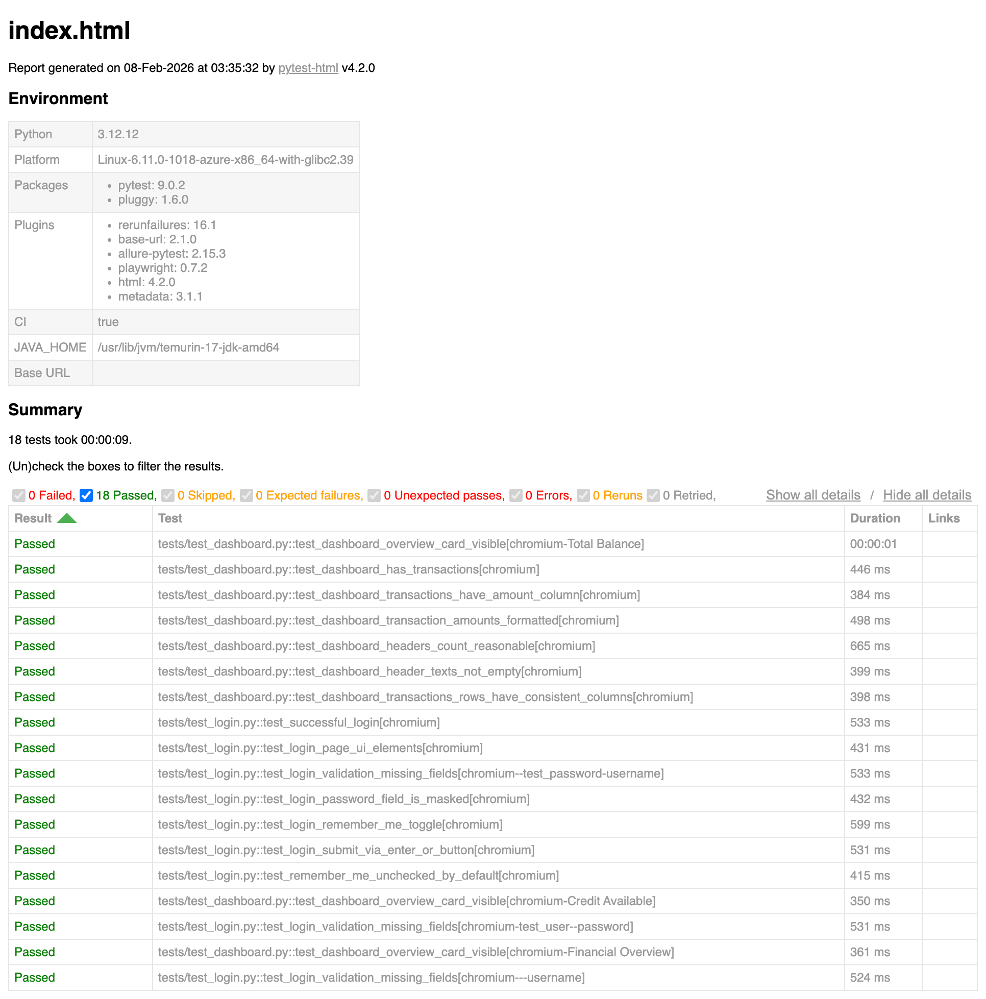
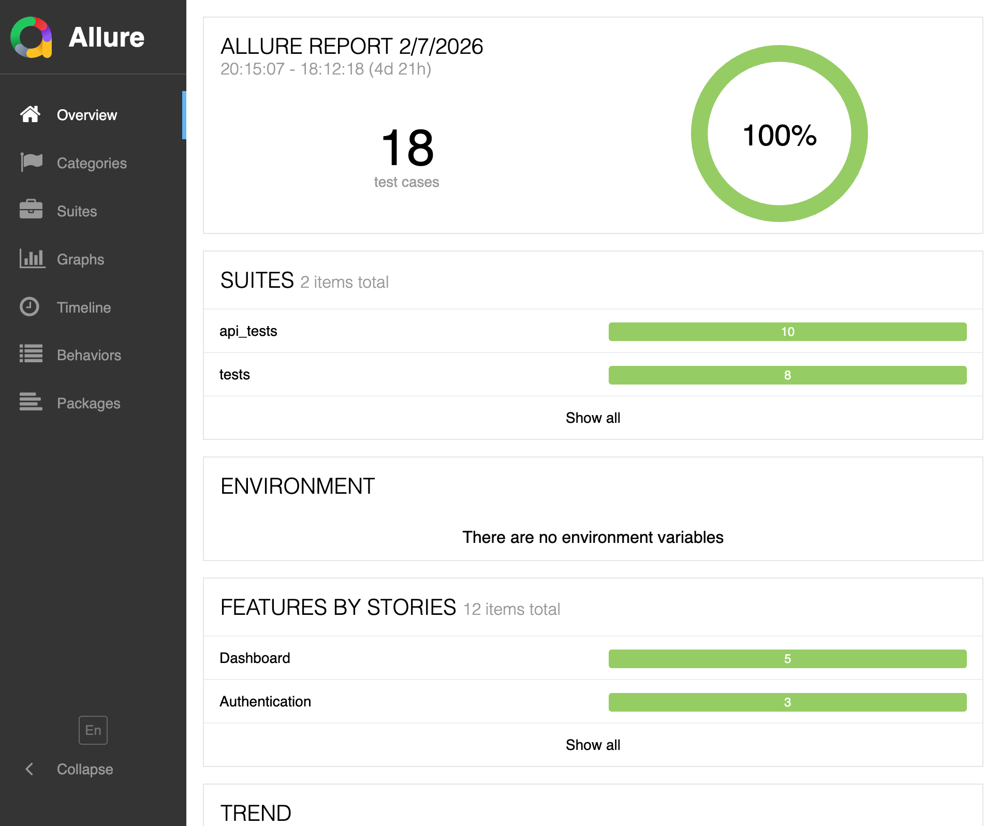

# Roman Petrov — SDET / QA Automation (Python)

<!-- Badges -->

I build reliable UI/API automation and CI pipelines that reduce regression time and improve release quality.

## Start here (60 sec)
- [playwright-tests repo](https://github.com/rmpetrov/playwright-tests)
- [sdet-toolbox repo](https://github.com/rmpetrov/sdet-toolbox)
- [Published report portal (GitHub Pages)](https://rmpetrov.github.io/playwright-tests/)
- [CI workflow files (playwright-tests)](https://github.com/rmpetrov/playwright-tests/tree/main/.github/workflows)
- [CI workflow files (sdet-toolbox)](https://github.com/rmpetrov/sdet-toolbox/tree/main/.github/workflows)
- [Architecture notes](#architecture-notes)
- [Flaky-test policy](#flaky-test-policy)

**Open to:** SDET / QA Automation roles (Remote, Hybrid, Onsite)  
**Location:** Boston, MA, USA  
**Work Authorization:** U.S. Citizen  
**Contact:** [rpetrovqa@gmail.com](mailto:rpetrovqa@gmail.com) · [LinkedIn](https://www.linkedin.com/in/rmpetrov/) · [Resume (PDF)](./Roman_Petrov_Resume.pdf)

---

## Highlights
- 7+ years in software testing (web apps, data-heavy systems)
- Built scalable Python automation frameworks for UI + API testing
- Integrated automation into CI/CD for fast, reliable feedback
- Strong focus on stable selectors, flake reduction, and fast triage

## Results
- Improved triage speed by publishing traces, screenshots, and logs with each CI run
- Reduced manual regression effort by moving repeatable checks into CI smoke and nightly suites
- Increased automation coverage across critical UI and API flows with reusable fixtures and data setup

## Tech Stack
**Languages:** Python, SQL, Java, JavaScript  
**Automation:** Playwright, Pytest, Selenium, TestNG  
**API Testing:** REST, Postman, Python `requests`  
**CI/CD & Tools:** GitHub Actions, Jenkins, Git, Docker  
**Databases:** Oracle, MySQL, PostgreSQL  
**Reporting:** Allure, pytest-html  

## What I Do
- Design automation strategy and architecture (POM, fixtures, shared utilities)
- Build UI and API test suites aligned to critical business flows
- Integrate tests into CI/CD (matrix, artifacts, reporting)
- Debug and analyze failures across UI, API, and backend logs

## Architecture Notes
- Keep UI interactions in page objects and shared helpers so tests stay readable
- Use fixtures for setup/teardown and stable test data
- Make CI artifacts first-class (traces, screenshots, logs) for fast debugging

## Flaky-Test Policy
- Treat flakiness as a bug and investigate root cause before adding retries
- Quarantine unstable tests with clear ownership and a tracked issue
- Prefer deterministic waits and stable selectors over time-based sleeps

## Featured Project
**playwright-tests** — UI & API automation framework  
- Cross-browser Playwright + Pytest with POM and fixtures
- API test module (reqres) with shared data setup
- Allure + HTML report auto-published via GitHub Pages
- CI matrix with artifacts for fast debugging
- [View repository: playwright-tests](https://github.com/rmpetrov/playwright-tests)
- [CI workflows](https://github.com/rmpetrov/playwright-tests/actions)
- [Published HTML report](https://rmpetrov.github.io/playwright-tests/)

Caption: GitHub Pages report portal (index page).

Caption: Allure report overview dashboard.

---

If you’re hiring or want to discuss QA automation, feel free to reach out.
